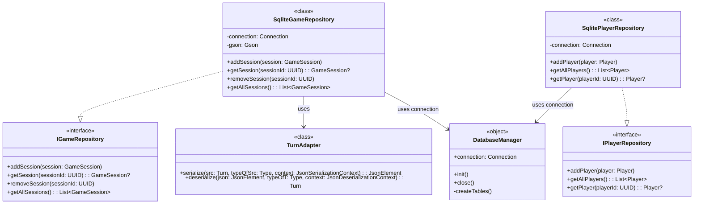

# 💣 Взрывные котята (Exploding kittens)

Графическое приложение (GUI) для администрирования настольной игры "Взрывные котята"

## Изменения в архитектуре

### Repositories & SQLite

```mermaid
classDiagram
    class IGameRepository {
        <<interface>>
        +addSession(session: GameSession)
        +getSession(sessionId: UUID): GameSession?
        +removeSession(sessionId: UUID)
        +getAllSessions(): List~GameSession~
    }

    class IPlayerRepository {
        <<interface>>
        +addPlayer(player: Player)
        +getAllPlayers(): List~Player~
        +getPlayer(playerId: UUID): Player?
    }

    class SqliteGameRepository {
        <<class>>
        -connection: Connection
        -gson: Gson
        +addSession(session: GameSession)
        +getSession(sessionId: UUID): GameSession?
        +removeSession(sessionId: UUID)
        +getAllSessions(): List~GameSession~
    }

    class SqlitePlayerRepository {
        <<class>>
        -connection: Connection
        +addPlayer(player: Player)
        +getAllPlayers(): List~Player~
        +getPlayer(playerId: UUID): Player?
    }

    class DatabaseManager {
        <<object>>
        +connection: Connection
        +init()
        +close()
        -createTables()
    }

    class TurnAdapter {
        <<class>>
        <<JsonSerializer~Turn~>>
        <<JsonDeserializer~Turn~>>
        +serialize(src: Turn, typeOfSrc: Type, context: JsonSerializationContext): JsonElement
        +deserialize(json: JsonElement, typeOfT: Type, context: JsonDeserializationContext): Turn
    }

    SqliteGameRepository ..|> IGameRepository
    SqlitePlayerRepository ..|> IPlayerRepository
    SqliteGameRepository --> TurnAdapter : uses
    SqliteGameRepository --> DatabaseManager : uses connection
    SqlitePlayerRepository --> DatabaseManager : uses connection
```
