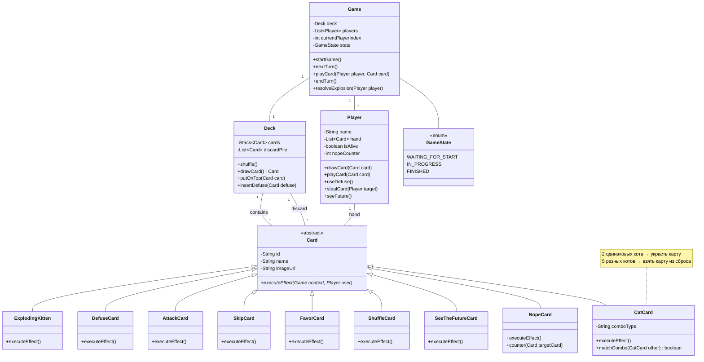

# 💣 Взрывные котята (Exploding kittens)

```mermaid
classDiagram
    class Game {
        -Deck deck
        -List~Player~ players
        -int currentPlayerIndex
        -GameState state
        +startGame()
        +nextTurn()
        +playCard(Player player, Card card)
        +endTurn()
        +resolveExplosion(Player player)
    }

    class GameState {
        <<enum>>
        WAITING_FOR_START
        IN_PROGRESS
        FINISHED
    }

    class Deck {
        -Stack~Card~ cards
        -List~Card~ discardPile
        +shuffle()
        +drawCard() Card
        +putOnTop(Card card)
        +insertDefuse(Card defuse)
    }

    class Player {
        -String name
        -List~Card~ hand
        -boolean isAlive
        -int nopeCounter
        +drawCard(Card card)
        +playCard(Card card)
        +useDefuse()
        +stealCard(Player target)
        +seeFuture()
    }

    class Card {
        <<abstract>>
        -String id
        -String name
        -String imageUrl
        +executeEffect(Game context, Player user)*
    }

    class ExplodingKitten {
        +executeEffect()
    }

    class DefuseCard {
        +executeEffect()
    }

    class AttackCard {
        +executeEffect()
    }

    class SkipCard {
        +executeEffect()
    }

    class FavorCard {
        +executeEffect()
    }

    class ShuffleCard {
        +executeEffect()
    }

    class SeeTheFutureCard {
        +executeEffect()
    }

    class NopeCard {
        +executeEffect()
        +counter(Card targetCard)
    }

    class CatCard {
        -String comboType
        +executeEffect()
        +matchCombo(CatCard other) boolean
    }

    Card <|-- ExplodingKitten
    Card <|-- DefuseCard
    Card <|-- AttackCard
    Card <|-- SkipCard
    Card <|-- FavorCard
    Card <|-- ShuffleCard
    Card <|-- SeeTheFutureCard
    Card <|-- NopeCard
    Card <|-- CatCard

    Game "1" -- "1" Deck
    Game "1" -- "*" Player
    Game -- GameState
    Player "1" -- "*" Card : hand
    Deck "1" -- "*" Card : contains
    Deck "1" -- "*" Card : discard

    note for CatCard "2 одинаковых кота → украсть карту
    5 разных котов → взять карту из сброса"
```