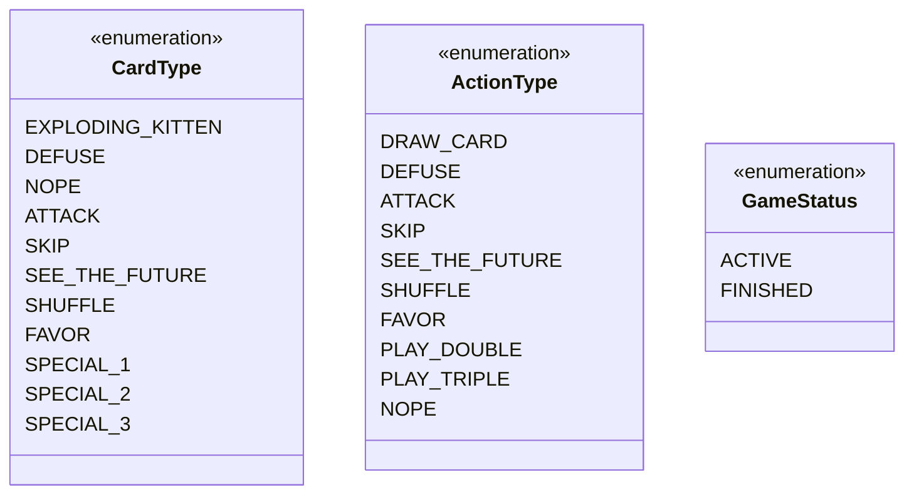
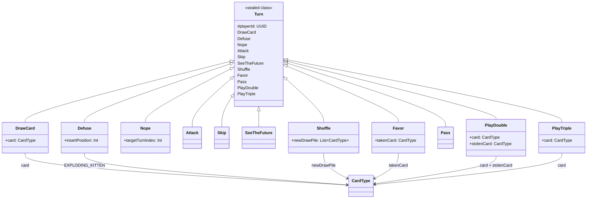
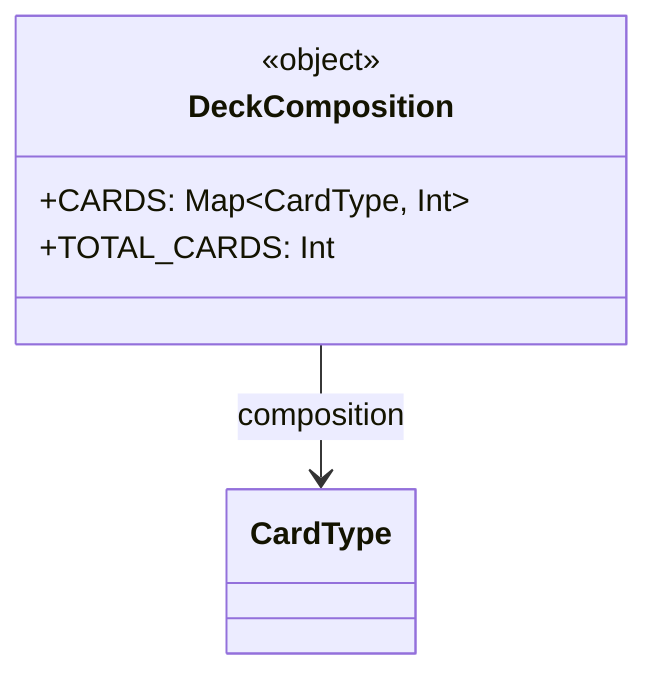
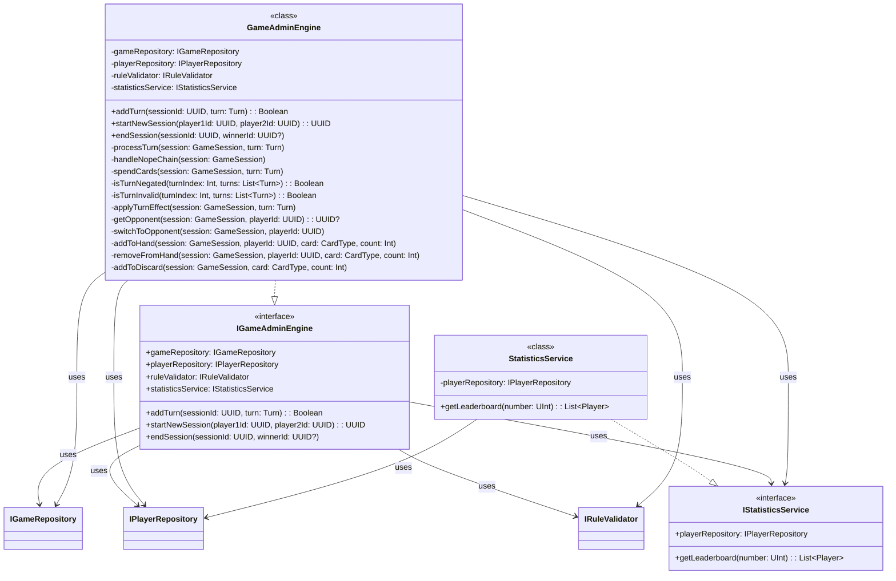
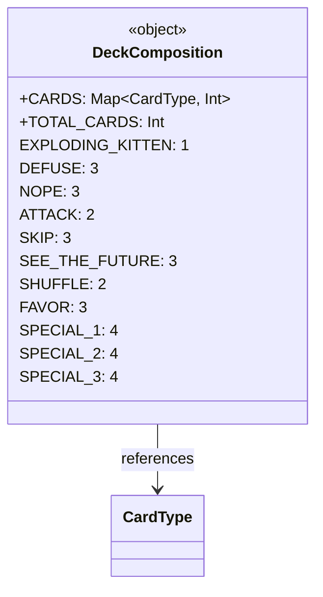
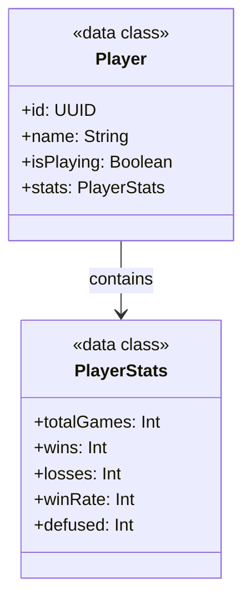
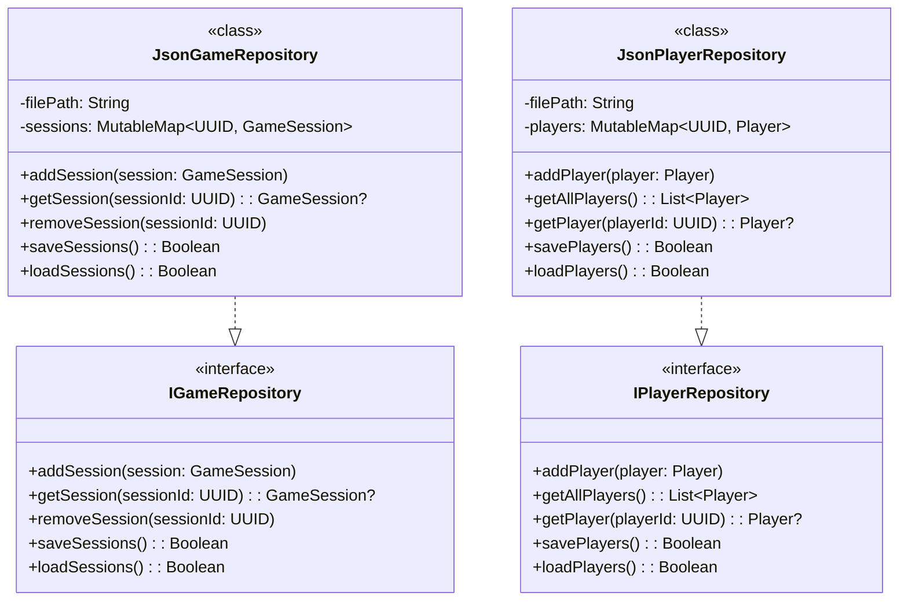
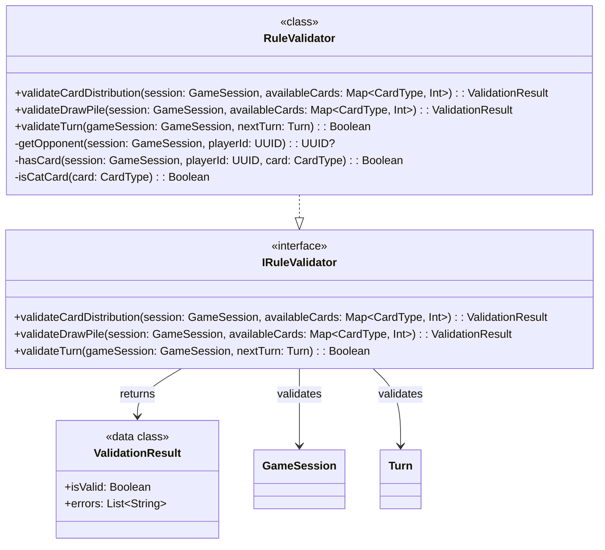
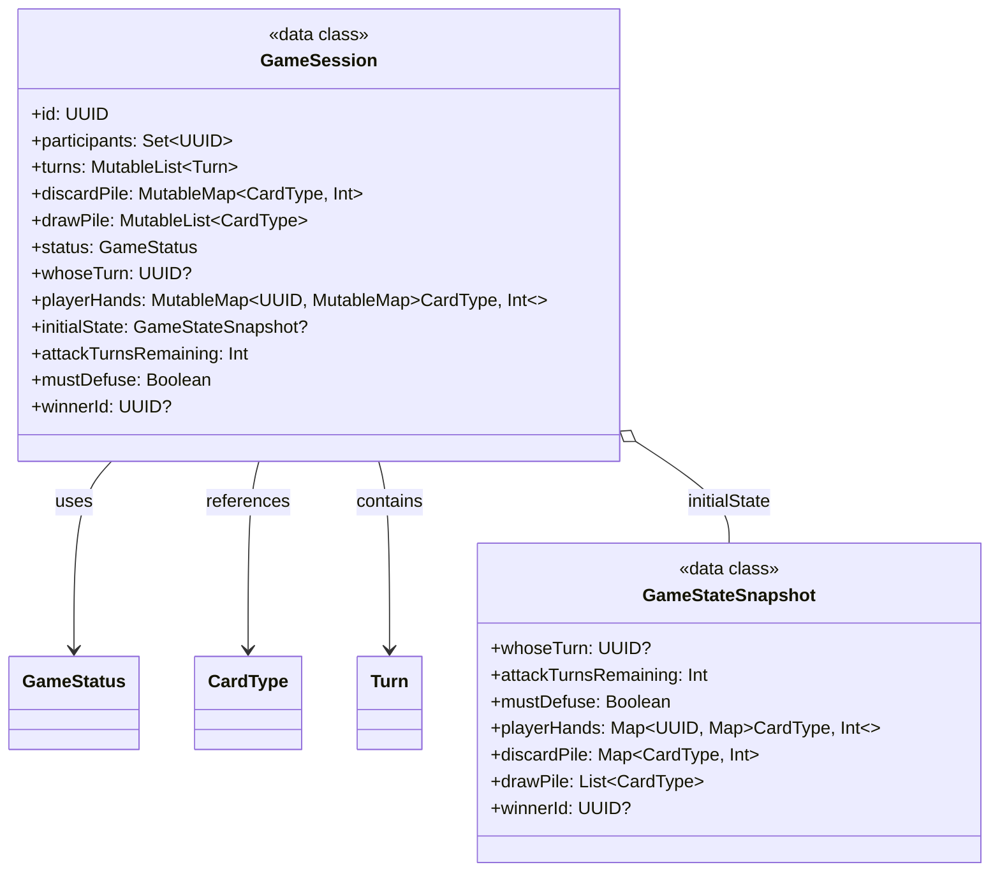

# Architecture 

## Enums

## Turn & Actions

## Cards & Deck

## Engine & Statistics

## Deck Composition

## Players & Statistics

## Repositories & JSON

## Rule Validation

## Session & State

