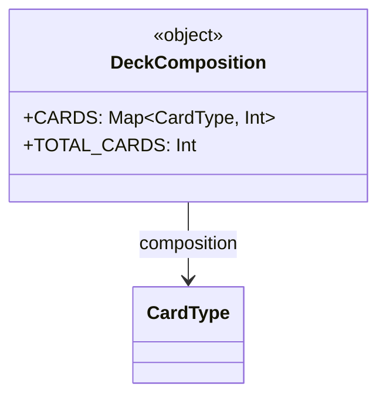

## Cards & Deck

```mermaid
classDiagram
    class CardType 

    class DeckComposition {
        <<object>>
        +CARDS: Map~CardType, Int~
        +TOTAL_CARDS: Int
    }

    DeckComposition --> CardType : composition
```
