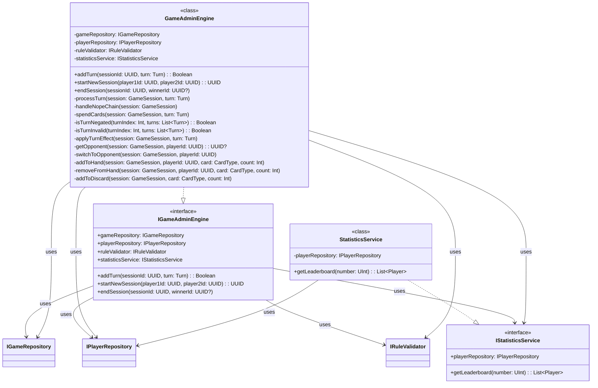

## Engine & Statistics

```mermaid
classDiagram
    class IGameAdminEngine {
        <<interface>>
        +gameRepository: IGameRepository
        +playerRepository: IPlayerRepository
        +ruleValidator: IRuleValidator
        +statisticsService: IStatisticsService
        +addTurn(sessionId: UUID, turn: Turn): Boolean
        +startNewSession(player1Id: UUID, player2Id: UUID): UUID
        +endSession(sessionId: UUID, winnerId: UUID?)
    }

    class GameAdminEngine {
        <<class>>
        -gameRepository: IGameRepository
        -playerRepository: IPlayerRepository
        -ruleValidator: IRuleValidator
        -statisticsService: IStatisticsService
        +addTurn(sessionId: UUID, turn: Turn): Boolean
        +startNewSession(player1Id: UUID, player2Id: UUID): UUID
        +endSession(sessionId: UUID, winnerId: UUID?)
        -processTurn(session: GameSession, turn: Turn)
        -handleNopeChain(session: GameSession)
        -spendCards(session: GameSession, turn: Turn)
        -isTurnNegated(turnIndex: Int, turns: List~Turn~): Boolean
        -isTurnInvalid(turnIndex: Int, turns: List~Turn~): Boolean
        -applyTurnEffect(session: GameSession, turn: Turn)
        -getOpponent(session: GameSession, playerId: UUID): UUID?
        -switchToOpponent(session: GameSession, playerId: UUID)
        -addToHand(session: GameSession, playerId: UUID, card: CardType, count: Int)
        -removeFromHand(session: GameSession, playerId: UUID, card: CardType, count: Int)
        -addToDiscard(session: GameSession, card: CardType, count: Int)
    }

    class IStatisticsService {
        <<interface>>
        +playerRepository: IPlayerRepository
        +getLeaderboard(number: UInt): List~Player~
    }

    class StatisticsService {
        <<class>>
        -playerRepository: IPlayerRepository
        +getLeaderboard(number: UInt): List~Player~
    }

    GameAdminEngine ..|> IGameAdminEngine
    StatisticsService ..|> IStatisticsService
    IGameAdminEngine --> IGameRepository : uses
    IGameAdminEngine --> IPlayerRepository : uses
    IGameAdminEngine --> IRuleValidator : uses
    IGameAdminEngine --> IStatisticsService : uses
    GameAdminEngine --> IGameRepository : uses
    GameAdminEngine --> IPlayerRepository : uses
    GameAdminEngine --> IRuleValidator : uses
    GameAdminEngine --> IStatisticsService : uses
    StatisticsService --> IPlayerRepository : uses
```
