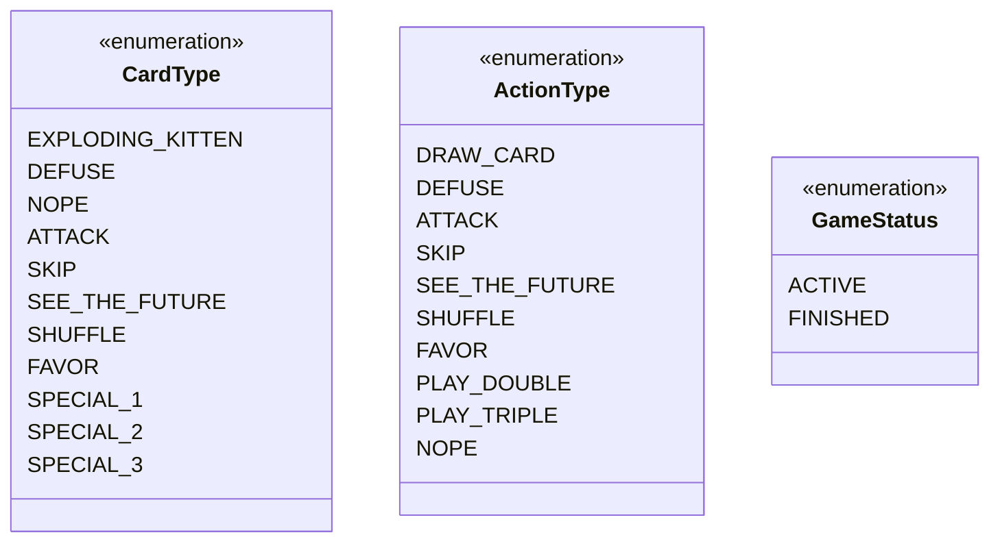

## Enums

```mermaid
classDiagram
    class CardType {
        <<enumeration>>
        EXPLODING_KITTEN
        DEFUSE
        NOPE
        ATTACK
        SKIP
        SEE_THE_FUTURE
        SHUFFLE
        FAVOR
        SPECIAL_1
        SPECIAL_2
        SPECIAL_3
    }

    class ActionType {
        <<enumeration>>
        DRAW_CARD
        DEFUSE
        ATTACK
        SKIP
        SEE_THE_FUTURE
        SHUFFLE
        FAVOR
        PLAY_DOUBLE
        PLAY_TRIPLE
        NOPE
    }

    class GameStatus {
        <<enumeration>>
        ACTIVE
        FINISHED
    }
```
