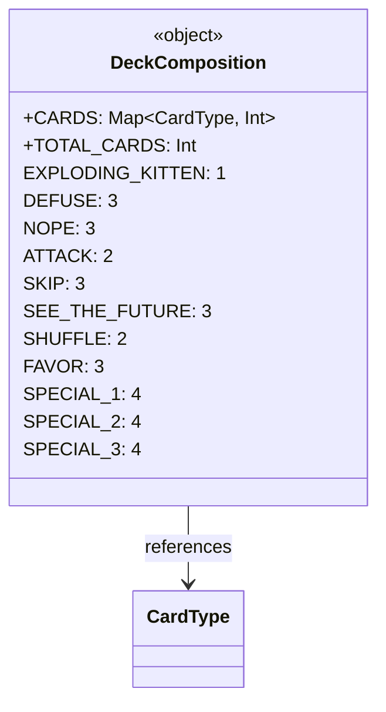

## Deck Composition

```mermaid
classDiagram
    class DeckComposition {
        <<object>>
        +CARDS: Map~CardType, Int~
        +TOTAL_CARDS: Int

        EXPLODING_KITTEN: 1
        DEFUSE: 3
        NOPE: 3
        ATTACK: 2
        SKIP: 3
        SEE_THE_FUTURE: 3
        SHUFFLE: 2
        FAVOR: 3
        SPECIAL_1: 4
        SPECIAL_2: 4
        SPECIAL_3: 4
    }

    DeckComposition --> CardType : references
```
