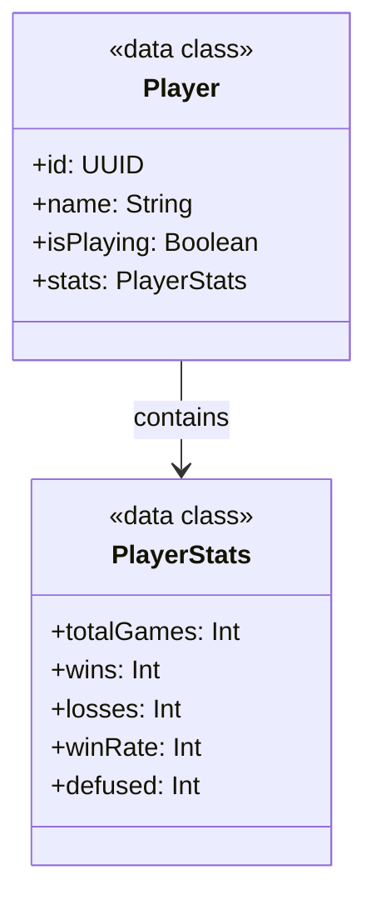

## Players & Statistics

```mermaid
classDiagram
    class Player {
        <<data class>>
        +id: UUID
        +name: String
        +isPlaying: Boolean
        +stats: PlayerStats
    }

    class PlayerStats {
        <<data class>>
        +totalGames: Int
        +wins: Int
        +losses: Int
        +winRate: Int
        +defused: Int
    }

    Player --> PlayerStats : contains
```
