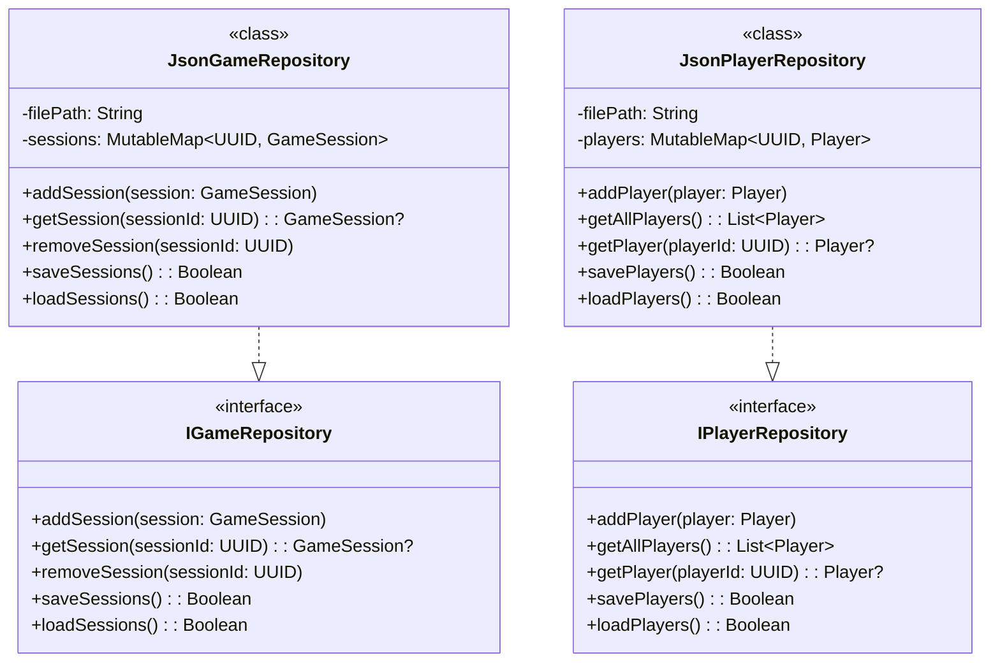

## Repositories & JSON

```mermaid
classDiagram
    class IGameRepository {
        <<interface>>
        +addSession(session: GameSession)
        +getSession(sessionId: UUID): GameSession?
        +removeSession(sessionId: UUID)
        +saveSessions(): Boolean
        +loadSessions(): Boolean
    }

    class IPlayerRepository {
        <<interface>>
        +addPlayer(player: Player)
        +getAllPlayers(): List~Player~
        +getPlayer(playerId: UUID): Player?
        +savePlayers(): Boolean
        +loadPlayers(): Boolean
    }

    class JsonGameRepository {
        <<class>>
        -filePath: String
        -sessions: MutableMap~UUID, GameSession~
        +addSession(session: GameSession)
        +getSession(sessionId: UUID): GameSession?
        +removeSession(sessionId: UUID)
        +saveSessions(): Boolean
        +loadSessions(): Boolean
    }

    class JsonPlayerRepository {
        <<class>>
        -filePath: String
        -players: MutableMap~UUID, Player~
        +addPlayer(player: Player)
        +getAllPlayers(): List~Player~
        +getPlayer(playerId: UUID): Player?
        +savePlayers(): Boolean
        +loadPlayers(): Boolean
    }

    JsonGameRepository ..|> IGameRepository
    JsonPlayerRepository ..|> IPlayerRepository
```
