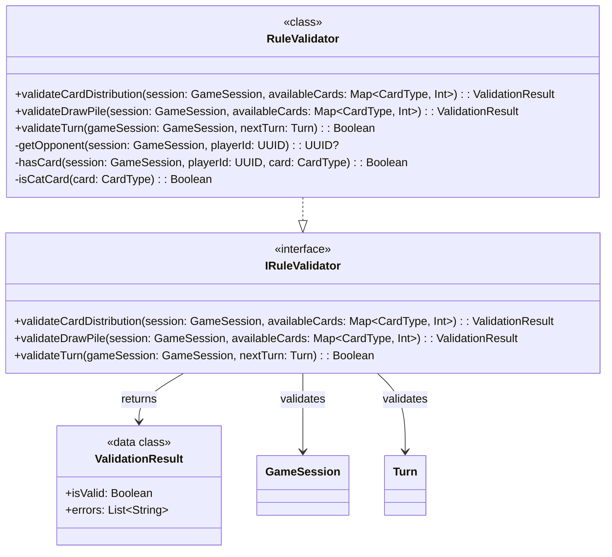

## Rule Validation

```mermaid
classDiagram
    class IRuleValidator {
        <<interface>>
        +validateCardDistribution(session: GameSession, deckComposition: Map~CardType, Int~, availableCards: Map~CardType, Int~): ValidationResult
        +validateDrawPile(session: GameSession, deckComposition: Map~CardType, Int~, availableCards: Map~CardType, Int~): ValidationResult
        +validateTurn(gameSession: GameSession, nextTurn: Turn): Boolean
    }

    class RuleValidator {
        <<class>>
        +validateCardDistribution(session: GameSession, deckComposition: Map~CardType, Int~, availableCards: Map~CardType, Int~): ValidationResult
        +validateDrawPile(session: GameSession, deckComposition: Map~CardType, Int~, availableCards: Map~CardType, Int~): ValidationResult
        +validateTurn(gameSession: GameSession, nextTurn: Turn): Boolean
        -getOpponent(session: GameSession, playerId: UUID): UUID?
        -hasCard(session: GameSession, playerId: UUID, card: CardType): Boolean
        -isCatCard(card: CardType): Boolean
    }

    class ValidationResult {
        <<data class>>
        +isValid: Boolean
        +errors: List~String~
    }

    RuleValidator ..|> IRuleValidator
    IRuleValidator --> ValidationResult : returns
    IRuleValidator --> GameSession : validates
    IRuleValidator --> Turn : validates
```
