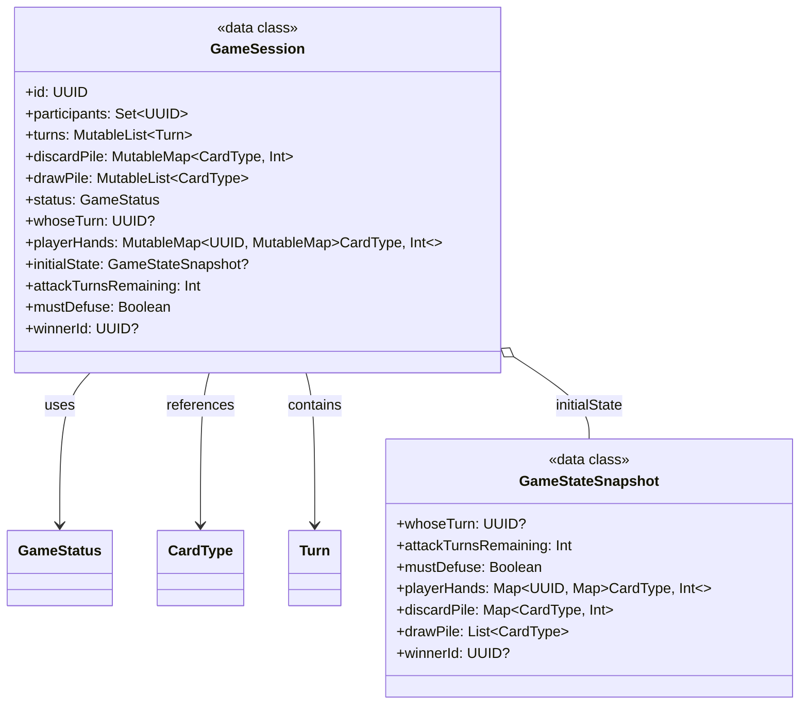

## Session & State

```mermaid
classDiagram
    class GameSession {
        <<data class>>
        +id: UUID
        +participants: Set~UUID~
        +turns: MutableList~Turn~
        +discardPile: MutableMap~CardType, Int~
        +drawPile: MutableList~CardType~
        +status: GameStatus
        +whoseTurn: UUID?
        +playerHands: MutableMap~UUID, MutableMap~CardType, Int~~
        +initialState: GameStateSnapshot?
        +attackTurnsRemaining: Int
        +mustDefuse: Boolean
        +winnerId: UUID?
    }

    class GameStateSnapshot {
        <<data class>>
        +whoseTurn: UUID?
        +attackTurnsRemaining: Int
        +mustDefuse: Boolean
        +playerHands: Map~UUID, Map~CardType, Int~~
        +discardPile: Map~CardType, Int~
        +drawPile: List~CardType~
        +winnerId: UUID?
    }

    GameSession --> GameStatus : uses
    GameSession --> CardType : references
    GameSession --> Turn : contains
    GameSession o-- GameStateSnapshot : initialState
```
