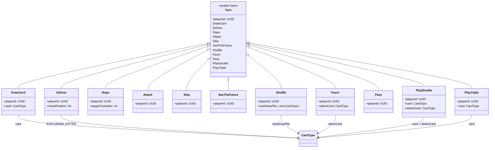

## Turn & Actions

```mermaid
classDiagram
    class Turn {
        <<sealed class>>
        #playerId: UUID

        DrawCard
        Defuse
        Nope
        Attack
        Skip
        SeeTheFuture
        Shuffle
        Favor
        Pass
        PlayDouble
        PlayTriple
    }

    class DrawCard {
        +playerId: UUID
        +card: CardType
    }

    class Defuse {
        +playerId: UUID
        +insertPosition: Int
    }

    class Nope {
        +playerId: UUID
        +targetTurnIndex: Int
    }

    class Attack {
        +playerId: UUID
    }

    class Skip {
        +playerId: UUID
    }

    class SeeTheFuture {
        +playerId: UUID
    }

    class Shuffle {
        +playerId: UUID
        +newDrawPile: List~CardType~
    }

    class Favor {
        +playerId: UUID
        +takenCard: CardType
    }

    class Pass {
        +playerId: UUID
    }

    class PlayDouble {
        +playerId: UUID
        +card: CardType
        +stolenCard: CardType
    }

    class PlayTriple {
        +playerId: UUID
        +card: CardType
    }

    Turn <|-- DrawCard
    Turn <|-- Defuse
    Turn <|-- Nope
    Turn <|-- Attack
    Turn <|-- Skip
    Turn <|-- SeeTheFuture
    Turn <|-- Shuffle
    Turn <|-- Favor
    Turn <|-- Pass
    Turn <|-- PlayDouble
    Turn <|-- PlayTriple

    DrawCard --> CardType : card
    Defuse --> CardType : EXPLODING_KITTEN
    Shuffle --> CardType : newDrawPile
    Favor --> CardType : takenCard
    PlayDouble --> CardType : card + stolenCard
    PlayTriple --> CardType : card
```
